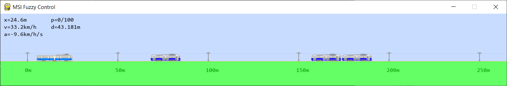

# Fuzzy Controller



https://www.youtube.com/watch?v=WRrMYUvBCyc&list=PLpY1-ltiKjD1Fdy4vMQtm8wSxqvVBKm07&index=2

#### Requirements
* Python 3.8
* numpy
* scikit-fuzzy
* matplotlib
* pygame

#### Installation
1. Verify Python version
```bash
python --version
```

2. Install requirements
```bash
pip install -r requirements.txt
```

#### Usage
1. Display plots of fuzzy variables
```bash
python control.py
```

2. Launch the simulator
```bash
python simulator.py
```

* Click left mouse button to place new vehicle
* Press <kbd>Delete</kbd> to remove nearest vehicle
* Press <kbd>+</kbd> to increase or <kbd>-</kbd> to decrease the number of passengers by 5
* Press <kbd>*</kbd> to increase speed by 10 km/h
* Press <kbd>P</kbd> to pause
* Press <kbd>Esc</kbd> or <kbd>Q</kbd> to exit
